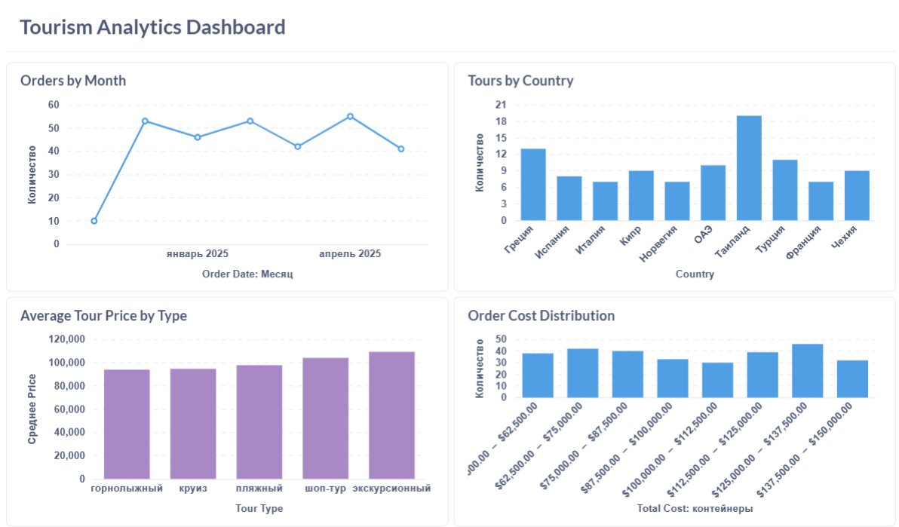

# Аналитический проект туристической компании (SQL + Python)

Этот проект моделирует работу туристической компании и демонстрирует полный цикл работы аналитика данных:  
построение схемы БД, генерацию реалистичных данных, аналитические SQL-запросы и визуализацию ключевых метрик средствами Python.


## 📊 Dashboard Overview (Metabase)

В рамках проекта был создан интерактивный аналитический дашборд в Metabase, включающий ключевые продуктовые метрики:

### **1. Orders by Month**
Анализ динамики количества заказов по месяцам позволяет оценивать сезонность спроса и эффективность маркетинговых активностей.

### **2. Tours by Country**
Распределение туров по странам — помогает понимать предпочтения клиентов и структуру ассортимента.

### **3. Average Tour Price by Type**
Средняя стоимость туров каждого типа — позволяет сравнить ценовые сегменты и маржинальность направлений.

### **4. Order Cost Distribution**
Распределение суммы заказов — позволяет выявить типичный чек и потенциальные выбросы.

---

## 🖼 Финальный дашборд




---

## 📌 Стек технологий

- **PostgreSQL** — база данных  
- **SQL** — аналитические запросы, индексы, JOIN, группировки  
- **Python** — pandas, matplotlib, seaborn  
- **Faker** — генерация реалистичных данных  
- **psycopg2** — подключение к PostgreSQL  
- **Jupyter/IDE** — разработка и отладка аналитических скриптов  

---

## 📁 Структура проекта

sql/ — схема БД и SQL-скрипты для заполнения и анализа
python/ — генерация данных и визуализация метрик
docs/ — отчёт по проекту и ER-диаграмма
plots/ — сохранённые графики

---

### Основные файлы

- `sql/schema.sql` — создание таблиц: clients, tours, orders, discounts  
- `sql/fill_clients_realistic.sql` — реалистичные данные клиентов  
- `sql/fill_tours_realistic.sql` — данные о турах  
- `sql/fill_orders_realistic.sql` — данные по заказам  
- `sql/fill_discounts_realistic.sql` — данные по скидкам  
- `sql/typical_queries.sql` — подборка аналитических запросов  

- `python/data_generator.py` — генерация всех SQL-скриптов с помощью Faker  
- `python/visualize_tourism.py` — построение и сохранение графиков  
- `python/requirements.txt` — зависимости Python  

- `docs/report_hiud_tourism.pdf` — подробное описание предметной области и структуры БД  

---

## 🏗 Модель данных

Проект основан на классической модели туристического бизнеса.  
Используются четыре связанные таблицы:

### **clients**
- `client_id`
- `full_name`
- `email`, `phone`
- `is_regular`
- `is_blacklisted`

### **tours**
- `tour_id`
- `country`, `region`, `hotel_name`
- `tour_type`
- `duration_days`
- `price`

### **orders**
- `order_id`
- `client_id` → FK → clients  
- `tour_id` → FK → tours  
- `order_date`
- `status`
- `total_cost`

### **discounts**
- `discount_id`
- `client_id` → FK → clients  
- `percentage`
- `reason`

Связи:

- **1 клиент → N заказов**  
- **1 тур → N заказов**  
- **1 клиент → N скидок**

ER-диаграмма находится в `docs/report_hiud_tourism.pdf`.

---

## 📊 Аналитические SQL-запросы

Файл `sql/typical_queries.sql` содержит готовые аналитические запросы, отвечающие на реальные бизнес-вопросы:

- распределение заказов по статусам;  
- средняя стоимость туров по типу;  
- ТОП-клиенты по числу заказов;  
- популярные направления по странам;  
- самые дорогие туры и заказы;  
- анализ клиентов из чёрного списка;  
- клиенты со скидками и причинами скидок;  
- средняя длительность туров по типам;  
- динамика заказов по месяцам.  

Эти запросы отражают типичные задачи аналитика турбизнеса.

---

## 📈 Визуализация данных (Python)

Скрипт `python/visualize_tourism.py` строит ключевые графики:

1. Количество заказов по месяцам  
2. Средняя цена туров по типам  
3. Количество туров по странам  
4. Распределение стоимости заказов  

Графики автоматически сохраняются в папку `plots/`:


---

## 🚀 Как развернуть проект локально

### 1. Создать базу данных PostgreSQL
Например:

```sql
CREATE DATABASE tourism_db;
2. Выполнить схему БД
psql -d tourism_db -f sql/schema.sql
3. Загрузить данные

psql -d tourism_db -f sql/fill_clients_realistic.sql
psql -d tourism_db -f sql/fill_tours_realistic.sql
psql -d tourism_db -f sql/fill_orders_realistic.sql
psql -d tourism_db -f sql/fill_discounts_realistic.sql

4. Установить зависимости Python

pip install -r python/requirements.txt
5. Обновить параметры подключения в visualize_tourism.py
(указать свои host/user/password)

6. Запустить визуализацию
python python/visualize_tourism.py
Графики появятся в папке plots/.